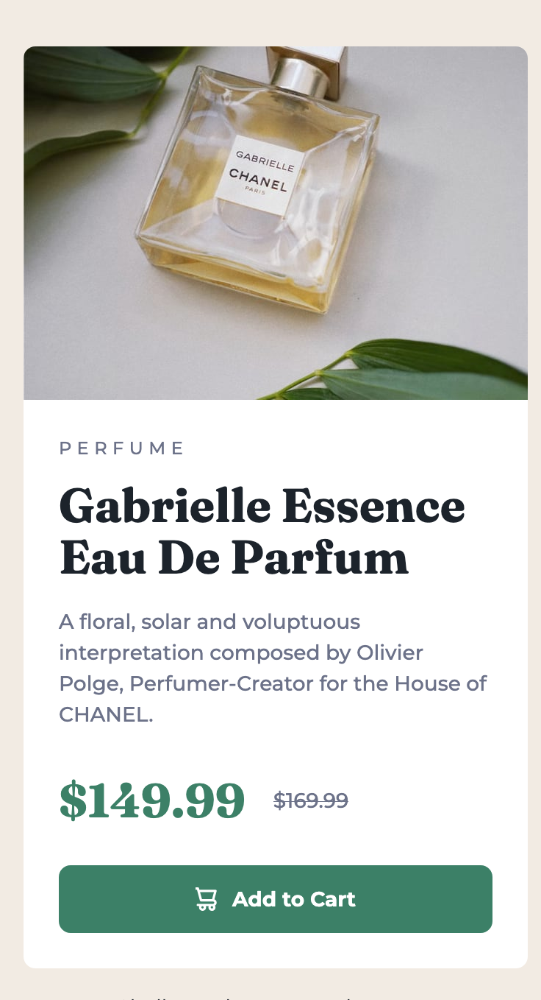

# Frontend Mentor - Product preview card component solution

This is a solution to the [Product preview card component challenge on Frontend Mentor](https://www.frontendmentor.io/challenges/product-preview-card-component-GO7UmttRfa).

## Table of contents

- [Overview](#overview)
  - [The challenge](#the-challenge)
  - [Screenshot](#screenshot)
  - [Links](#links)
- [My process](#my-process)
  - [Built with](#built-with)
  - [What I learned](#what-i-learned)
  - [Useful resources](#useful-resources)
- [Author](#author)

## Overview

### The challenge

Users should be able to:

- View the optimal layout depending on their device's screen size
- See hover and focus states for interactive elements

### Screenshot

Mobile view:

Desktop view:

### Links

- [Solution URL](https://www.frontendmentor.io/solutions/responsive-product-preview-card-component-using-flexbox-and-bem-aciRskuoDV)
- [Live site URL](https://fem-product-preview-card-component-seven.vercel.app/)

## My process

### Built with

- Semantic HTML5 markup
- CSS custom properties
- Flexbox
- Mobile-first workflow

### What I learned

In this project, I tried to use the correct syntax for BEM. 

In previous projects I tried to use BEM-like naming for the classes, but didn't use the appropriate syntax.

### Useful resources

- [How to translate a design into HTML: Product Preview Card](https://fedmentor.dev/posts/html-plan-product-preview/) - I used this article as a guideline for writing accessible and semanticly correct HTML for this project. It also linked to helpful resources (inluding an article on BEM, which prompted me to actually use the correct syntax this time).
- [VoiceOver Keyboard Shortcuts on a Mac](https://dequeuniversity.com/screenreaders/voiceover-keyboard-shortcuts) - I used VoiceOver for the first time to test the `sr-only` content I used in the HTML. This article served as a helpful reference for the keyboard shortcuts.
## Author

- [Frontend Mentor Profile](https://www.frontendmentor.io/profile/dionysia-lemonaki)
- [LinkedIn Profile](https://www.linkedin.com/in/dionysia-lemonaki-developer/)

